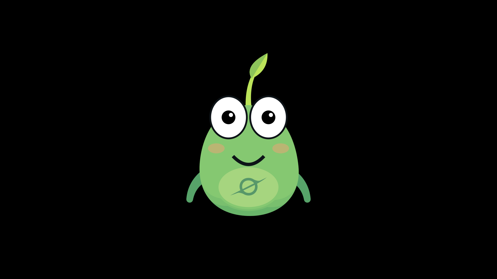
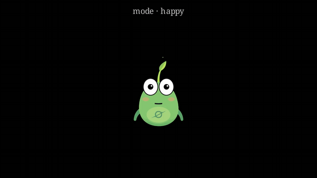
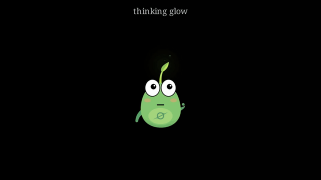

# Sprout 🌱

A [pi-creature](https://www.3blue1brown.com/)-inspired mascot character for
[ManimCE](https://www.manim.community/): a little seed with enormous eyes,
a leaf that is always alive, and a singularity on its belly.



| Expression modes | The living leaf |
| --- | --- |
|  |  |

*Full capability tour (1080p60): [assets/sprout_demo.mp4](assets/sprout_demo.mp4)*

## Features

- **14 swappable expression modes**: `plain`, `happy`, `sad`, `angry`,
  `surprised`, `love`, `thinking`, `sleepy`, `speaking`, `celebrate`,
  `wave`, `point_left`, `point_right`, `point_up`. Every mode SVG shares an
  identical 22-part core layout, so `change_mode` interpolates each named
  part 1:1. No fades, no popping.
- **A living leaf, always on**: flame-like idle sway from the moment the
  character is born, plus an ambient stream of ember motes (Gaussian
  cadence, fixed recycled pool) that starts when the sprout enters a scene.
  There is no API to turn this off; the leaf being alive is part of what a
  Sprout *is*.
- **Gaze acting**: `look_at(point_or_mobject)`, `look(direction)`,
  `look_at_viewer()`, `make_eye_contact(other)`. Gaze survives mode
  changes. Facing is acted with the eyes; the character never mirrors.
- **Speech & thought bubbles**: `Says` / `Thinks` animations using 3b1b's
  hand-drawn bubble shapes. Bubbles auto-open toward the center of the
  frame so edge speakers never push them off-screen.
- **Entrances that respect the layered body**: `SproutIn` / `SproutOut`
  grow the character out of the ground instead of fading (fading a layered
  character exposes the arm segments behind the body).
- **Scene preset**: `SproutClassroomScene`, one teacher + three students,
  mirroring 3b1b's `TeacherStudentsScene` interaction patterns.
- **An art-directed palette**: two OKLCH ramps (skin + leaf accent),
  occlusion under-shading, and stroke widths that scale with the drawing.

## Install

```bash
uv add git+https://github.com/HamdiBarkous/Sprout
# or
pip install git+https://github.com/HamdiBarkous/Sprout
```

Requires Python ≥ 3.12 and ManimCE ≥ 0.21.

## Quick start

```python
from manim import Scene
from sprout import Sprout, Says, Blink, SproutIn, SproutOut


class Hello(Scene):
    def construct(self):
        sprout = Sprout(mode="plain").scale(1.5)
        self.play(SproutIn(sprout))            # grows out of the ground
        self.play(sprout.change_mode_anim("happy"))
        self.play(Blink(sprout))
        self.play(Says(sprout, "Hi! I'm Sprout."))
        self.wait(1)
        self.play(sprout.remove_bubble_anim())
        self.play(SproutOut(sprout))
```

```bash
manim -pqh hello.py Hello
```

## The API in one look

| Thing | What it does |
| --- | --- |
| `Sprout(mode="plain")` | Build the character in any of the 14 modes |
| `sprout.change_mode(m)` / `change_mode_anim(m)` | Snap / animate to another expression |
| `sprout.look_at(x)` / `look(dir)` / `look_at_viewer()` | Aim the pupils |
| `sprout.make_eye_contact(other)` | Two sprouts look at each other |
| `sprout.to_corner_creature()` | Shrink into a corner, commentator-style |
| `Says(sprout, "…")` / `Thinks(sprout, "…")` | Bubble + mode change as one animation |
| `sprout.remove_bubble_anim()` | Fade the active bubble, return to a base mode |
| `SproutIn` / `SproutOut` | Entrance / exit (never `FadeIn` a sprout) |
| `Blink(sprout)` | Squash-blink |
| `LeafGlow(sprout)` | Warm halo behind the leaf (drive its `level` tracker) |
| `spawn_leaf_motes(scene, sprout)` | One-shot insight burst off the leaf tip |
| `SproutClassroomScene` | Teacher + students scene preset |

## Examples

The full showcase lives in [`examples/demo.py`](examples/demo.py):

```bash
uv run manim -qh examples/demo.py SproutDemo        # the everything-tour
uv run manim -qh examples/demo.py SproutShowcase    # all modes in a grid
uv run manim -qh examples/demo.py SproutClassroom   # teacher + students
uv run manim -qh examples/demo.py SproutLivingLeaf  # glow, flare, motes
```

## How the character works

Every mode SVG is emitted by [`src/sprout/generate.py`](src/sprout/generate.py)
with the **same 22 submobjects in the same order** (shadow, arms, leaf,
leaf shade, body, belly, two under-shade crescents, eyes, pupils, mouth,
blush, the 4-path belly mark). Pose changes move parts in place, never
add or remove them. That is what makes mode transforms clean.

After editing the generator, rebuild the SVGs:

```bash
uv run python src/sprout/generate.py
```

Design rules the generator encodes (the anti-clipart rules):

- The body is a hand-wobbled pear, not a perfect ellipse.
- The eyes are enormous and bulge above the head; they are where the
  acting happens.
- The leaf is the identity: two-tone blade, posed like a dog's ear
  (droops when sad, stands tall when excited).
- Skin colors descend a single OKLCH ramp (even value steps, warm-to-cool
  hue rotation); the leaf holds the chroma crown.
- The belly mark is a singularity: ring, accretion blade, and tangent
  fillets. Sprout carries his destination from frame zero.

## Credits

- Character concept and design: Hamdi Barkous, for the
  [Frame Zero](https://www.youtube.com/@Frame-zero-yt) channel.
- Designed and implemented in collaboration with
  [Claude](https://claude.com/claude-code) (Anthropic's Claude Opus).
- Deeply inspired by Grant Sanderson's pi creatures from
  [3Blue1Brown](https://www.3blue1brown.com/); the speech/thought bubble
  shapes are 3b1b's hand-drawn SVGs.
- Built on [ManimCE](https://www.manim.community/).

## License

[MIT](LICENSE)
